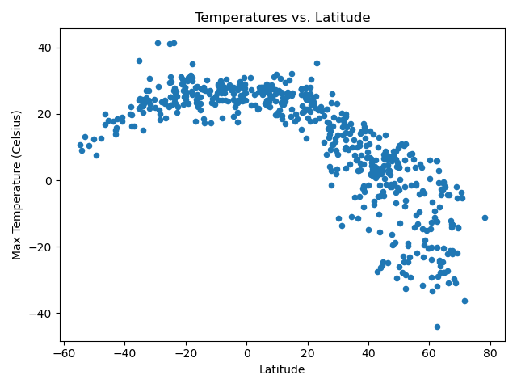
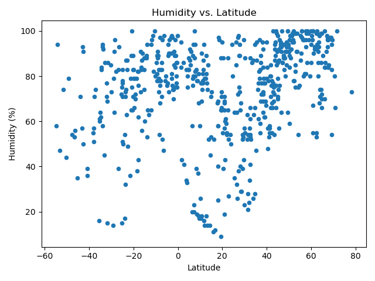
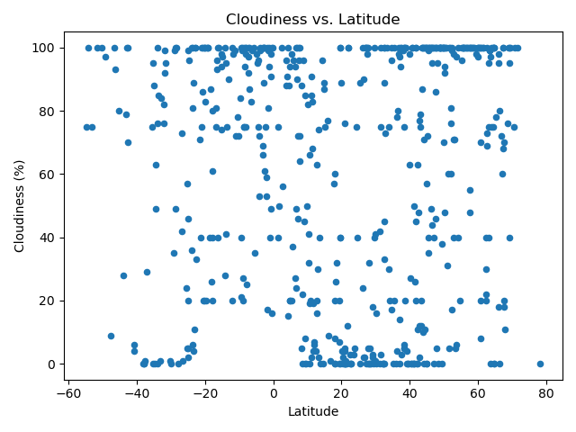
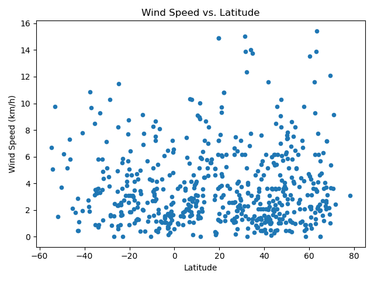

# python-api-challenge
Python Challenge dealing with Weather Nearing the Equator

#WeatherPy - Dealing with a series of 1500 random coordinates and any nearby cities
Determining any weather trends associated with changes in latitude using Open Weather API
Total Cities in List: 597

# Conclusions:
# Temp
 
In these two graphs, there is strong evidence to suggest that local temperatures as one travels closer to the equator whether from the north or the south. From either direction, the data trends towards 30 degrees Celsius as the latitude approaches 0. There is stronger correlation in the northern hemisphere data than the southern data.

# Humidity

Both datasets demonstrate a moderate correlation between relative humidity perentage and latitude (r=.4480 &.4131). However, the northern hemisphere demonstrates more humidity towards latitudes further from the equator while the inverse is true for the southern hemisphere. Warmer air generally holds more moisture than cold air, so it is noteworthy that the colder, northern latitudes have more humidity than the ones closer to the equator. One potential lead worth further analysis is the type of biome at each city -- maybe there are more deserts in these areas? Additionally, is there a relationship stemming from the inverted seasons of the hemispheres? Further data analysis could investigate the weather patterns in different times of the year to check for consistency.

# Cloudiness 

There is a weak correlation between cloudiness in both hemispheres. Both regression lines have an r-value below 0.3. The data trends are consistent with those of the humidity graphs, which makes sense. As humidity increases cloud formation would follow suit. Areas with 100% humidity are currently raining or snowing, and humidity below 10% make any cloud cover difficult

# Wind Speed

There is very weak evidence of correlation between latitude and wind speed. The r-values for the northern and southern hemispheres are .004 and .2 respectively. In most cities, the wind speed was found between 0-6 km/hr.

# Vacation Py - Using the list of cities to determine an ideal vacation spot based on weather conditions
Conditions used: Wind Speed < 5km/h, 0% Cloudiness, Max Temperature >22 Celsius

Found hotels close to these vacation cities using GeoApify
